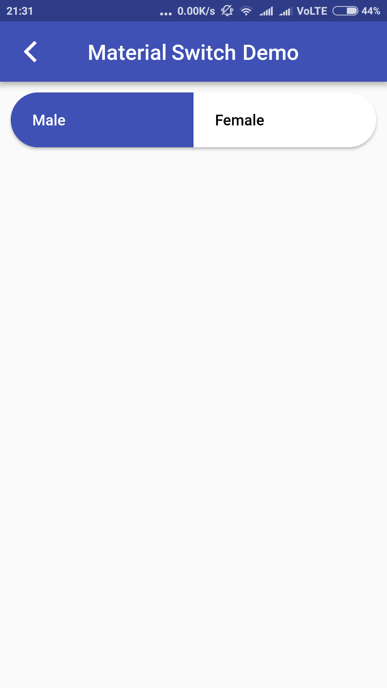

# material_switch

Material switch option using button widget

## Getting Started

### Image

For help getting started with Flutter, view our online [documentation](https://flutter.io/).

For help on editing package code, view the [documentation](https://flutter.io/developing-packages/).
